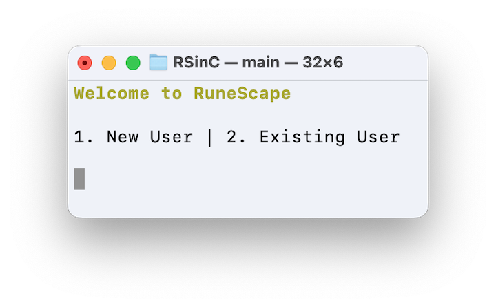
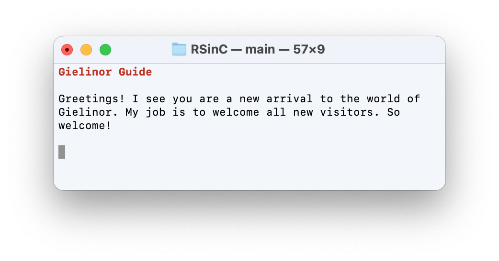
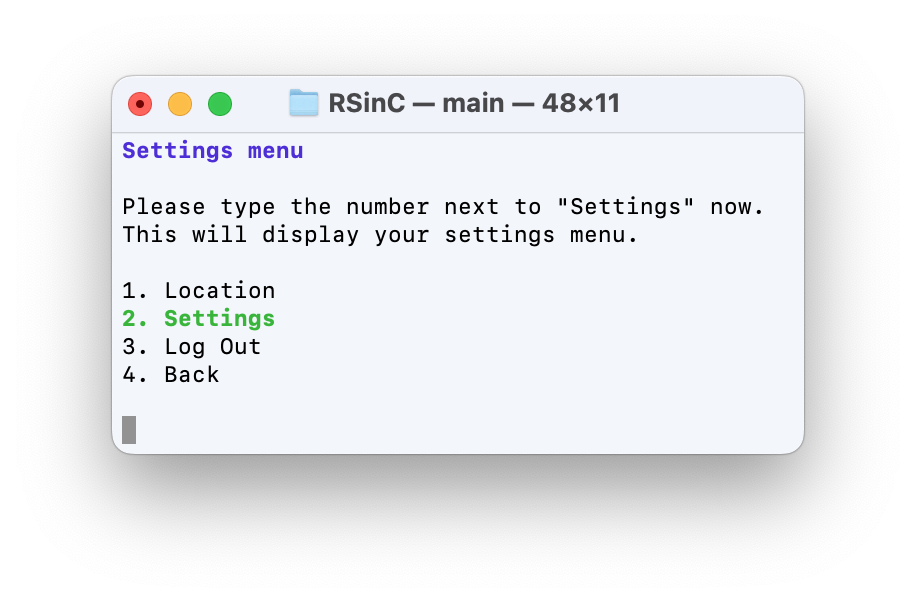
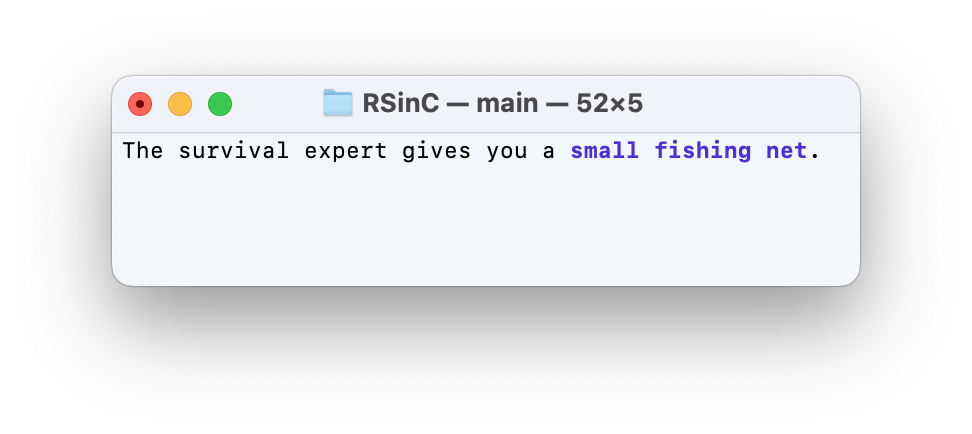
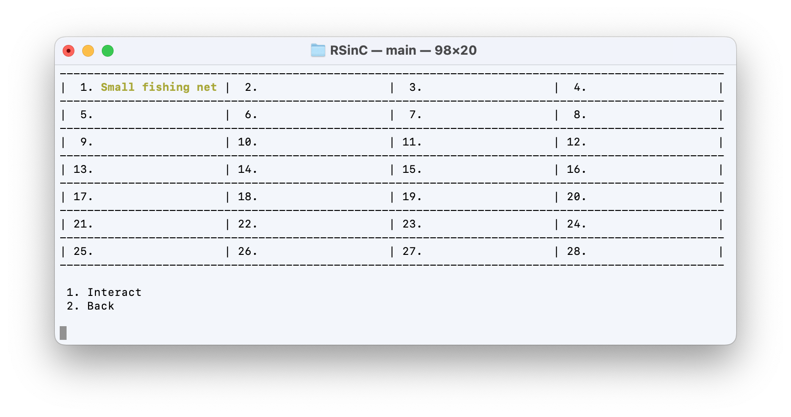
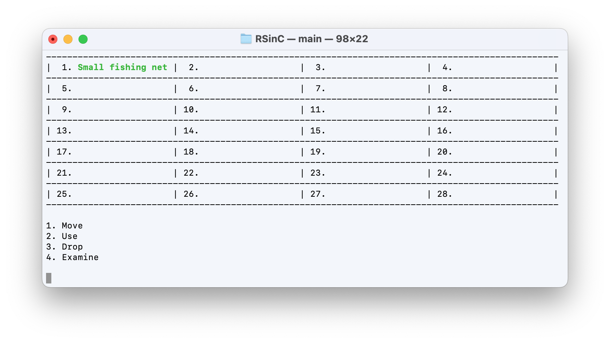
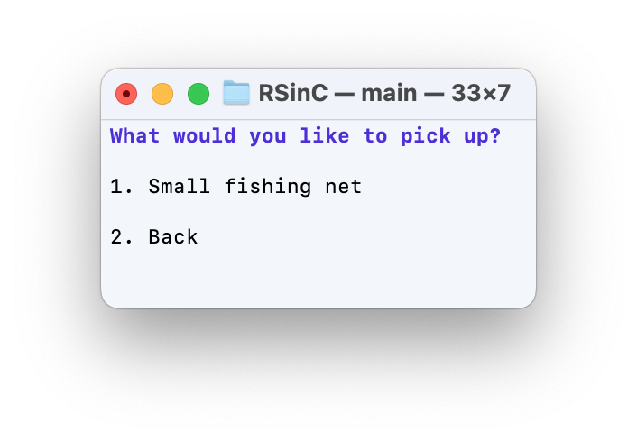
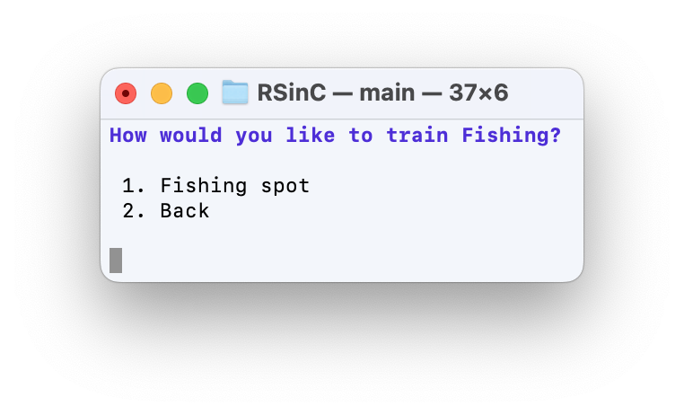
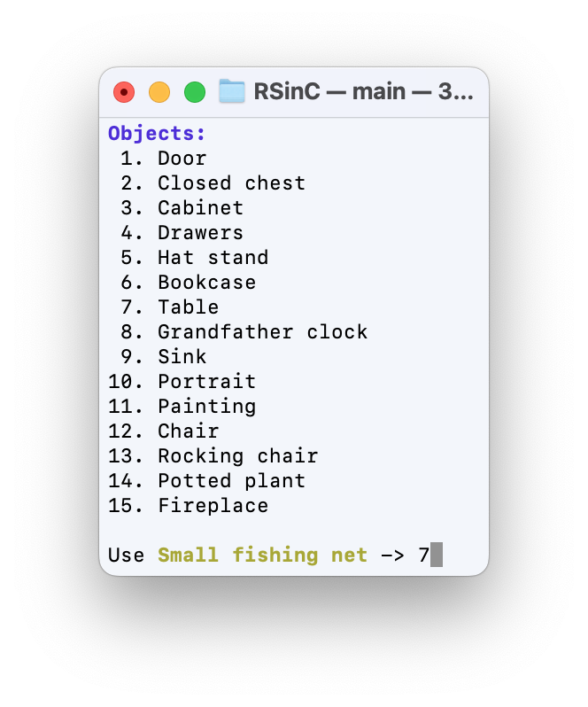
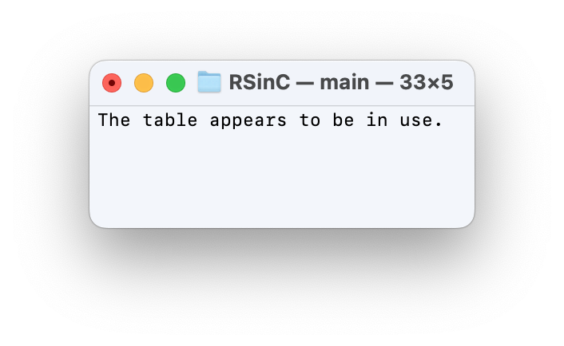

# RuneScape in C


RuneScape in C is a text-based recreation of the video game that originally inspired me to learn how to code back in the late 2000s/early 2010s. It is currently a representation of the log-in system, including account creation, and the first two sections of the tutorial of the game. RuneScape in C is meant to be as close to a perfect recreation as reasonable. All dialogues, results of interactions between items and objects, timings of skilling actions, etc. are accurate to the original game, using [Old School RuneScape](https://oldschool.runescape.com) during 2022 and [the associated wiki page](https://oldschool.runescape.wiki) as reference. 

<p align="center">
  
</p>

## Features

### Interacting with Non-Player Characters (NPCs)

NPCs are among the first of the features you experience. By being able to talk to characters like the **Gielinor Guide** or the **Survival Expert**, you're able to learn about different aspects of the game, recieve tools to train skills with, and progress through the game. 

<details><summary><b>Examples</b></summary>

<p align="center">
  
</p>

<p align="center">
  
</p>

<p align="center">
  
</p>

</details>

### Interacting with Items

Items are used for interacting with each other and many objects throughout the world of Gielinor. With an inventory for storing items, you are able to drop items, pick them up again (if you get to them before they despawn!), light fires by using a **Tinderbox** on some **Logs** you chopped, and more. 

<details><summary><b>Examples</b></summary>

<p align="center">
  
</p>

<p align="center">
  
</p>

<p align="center">
  
</p>

</details>

### Interacting with Objects

Objects are interacted with to allow a player to gain new items, experience in their skills, and more. Objects can be interacted with in different ways, depending on what they do. For example, you can fish or chops logs via *Train a Skill*. However, you can also fish by using your Small fishing net on a **Fishing spot**.

<details><summary><b>Examples</b></summary>

<p align="center">
  
</p>

<p align="center">
  
</p>

<p align="center">
  
</p>

</details>

## Files

* **game_functions.c** includes utility functions for the entirety of the game, such as *Press enter to continue*. Also includes all SQLite3-related functions that don't involve the log-in process.
* **general_menus.c** includes functions related to the basic menus within the game, including processing what options are available for those menus. Some menu utility functions are located here, with other more niche menu functions being in their niche's respective files.
* **items.c**  includes initialization of data for individual items and functions to interact with the items.
* **locations.c** includes information on where objects, non-player characters (NPCs), items, etc. are located within the world, along with information on different visitable locations within the game.
* **login.c** includes the logic for checking for the required database, creating it if necessary, and allowing a user to create an account or log in to an existing one.
* **main.c** is the main file of the game. It calls login and then loops continuously while accepting input to guide a player through menus. Upon receiving the required return value, the loop breaks, and a player is left with a goodbye message.
* **npcs.c** includes functions related to interacting with NPCs, along with their dialogue.
* **objects.c** includes functions related to interacting with objects in the game.
* **skills.c** includes functions related to training skills within the game. Items and objects are passed to these functions, with results calculated within the functions based on locations, character skill levels, random chance of success, etc.
* [**sqlite3.c**](https://www.sqlite.org/cintro.html) is the file that allows for interaction with the database that stores all user/character information.

## Installation
1. [Download](https://github.com/DevonMartin/RuneScape-in-C/archive/refs/heads/main.zip) this repository. *README.md* and the *img* folder can be deleted.
2. Open a Terminal window.
 * On MacOS, this can be done by pressing ```cmd-space``` to open *Spotlight Search*, typing *Terminal*, and pressing ```enter```.
 * On Windows, third party software may be required to continue. However, you can simply run the *RuneScape in C* file provided, and disregard the remaining installation instructions. This comes at the cost of not being able to verify the file yourself.
3. Change directories using ```cd ...``` into the location of the downloaded files.
4. Type ```make```. This will create *RuneScape in C*, the executable game.
5. Move *RuneScape in C* to your desired location, and delete all other files.
6. Double-click *RuneScape in C* to play!

## Original Video Demo

[YouTube](https://youtu.be/h1mt6AdUYqM/)

Please note that this video demo is from the original release. Many stylistic changes have been made since then, along with significant expansion to the program, and this should only be used as a reference to how far the project has come since then. 
